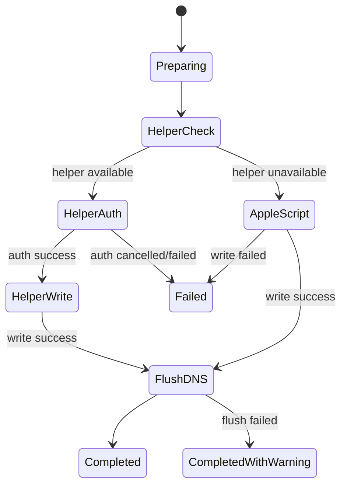
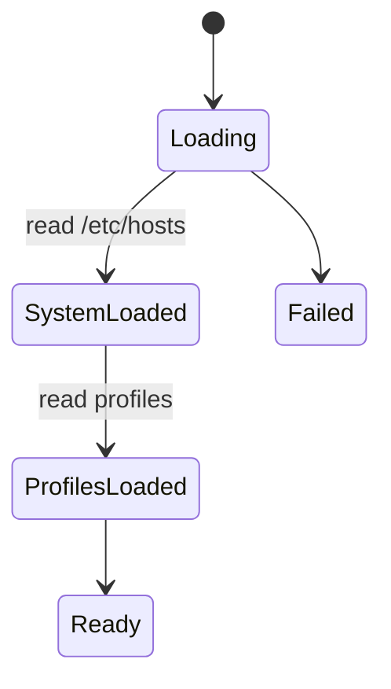

# SaneHosts Architecture

Last updated: 2026-02-02

## Purpose

SaneHosts is a native macOS app for managing `/etc/hosts` through curated profiles and blocklists. It provides safe activation/deactivation, backups, and DNS cache flushing without requiring Terminal usage.

## Non-goals

- No background network sync unless a user adds remote blocklist URLs.
- No cloud accounts or analytics.
- No direct editing of `/etc/hosts` without explicit user action.

## System Context

- **Host app**: SwiftUI UI + shared logic in `SaneHostsPackage`.
- **Privileged helper**: XPC LaunchDaemon for root writes to `/etc/hosts`.
- **Fallback path**: AppleScript with admin password if helper is unavailable.
- **Sparkle**: Update checks via appcast.
- **No GitHub DMG**: DMGs are hosted on Cloudflare R2, not in GitHub.

## Architecture Principles

- Prefer safe, reversible operations (backups, validation, warnings).
- Write access is explicit and authenticated.
- Separate system entries from user-managed entries.
- Favor deterministic parsing and merging of hosts data.

## Core Components

| Component | Responsibility | Key Files |
|---|---|---|
| ProfileStore | Loads/saves profiles, backups, system entries | `SaneHostsPackage/.../ProfileStore.swift` |
| HostsService | Read/write `/etc/hosts` with helper + fallback | `SaneHostsPackage/.../HostsService.swift` |
| HostsParser | Parse/merge hosts content | `SaneHostsPackage/.../HostsParser.swift` |
| RemoteSyncService | Fetch remote blocklists | `SaneHostsPackage/.../RemoteSyncService.swift` |
| DNSService | Flush DNS cache | `SaneHostsPackage/.../DNSService.swift` |
| AuthenticationService | Touch ID gating for helper path | `SaneHostsPackage/.../AuthenticationService.swift` |
| Helper (XPC) | Root write/flush/read operations | `SaneHostsHelper/*` |

## Data and Persistence

- **Profiles**: `~/Library/Application Support/SaneHosts/Profiles/`
- **Backups**: `~/Library/Application Support/SaneHosts/Backups/` (max 3 per profile)
- **Blocklist cache**: `~/Library/Application Support/SaneHosts/BlocklistCache/`
- **System hosts**: `/etc/hosts` (read and written via helper or AppleScript)

## Key Flows

### Profile Activation
1. ProfileStore loads system entries + selected profile.
2. HostsParser merges system entries + profile entries.
3. HostsService writes `/etc/hosts` (helper first, AppleScript fallback).
4. DNSService flushes cache; warning returned if flush fails.

### Profile Deactivation
1. ProfileStore keeps only system entries.
2. HostsService writes system-only content to `/etc/hosts`.
3. DNS cache is flushed.

### Remote Blocklist Import
1. RemoteSyncService fetches URLs.
2. Parser normalizes and deduplicates entries.
3. ProfileStore updates the profile and persists it.

## State Machines

### Profile Activation (Write Strategy)

| State | Meaning | Entry | Exit |
|---|---|---|---|
| Preparing | Build merged hosts content | activateProfile() | helper check |
| HelperCheck | Detect helper availability | HostsService | helper auth / AppleScript |
| HelperAuth | Touch ID authentication | AuthenticationService | write or fail |
| HelperWrite | XPC helper writes file | HostsHelperConnection | flush DNS |
| AppleScript | Admin password write | HostsService | flush DNS / fail |
| FlushDNS | Attempt DNS flush | DNSService | completed |
| Completed | Hosts updated successfully | flush ok | idle |
| CompletedWithWarning | Hosts updated, flush failed | flush error | idle |
| Failed | Write failure or auth cancelled | error | idle |

### Profile Load

| State | Meaning | Entry | Exit |
|---|---|---|---|
| Loading | Start load | ProfileStore.load() | system load |
| SystemLoaded | System entries parsed | parseSystemHosts() | profiles load |
| ProfilesLoaded | Profiles read from disk | loadProfiles() | ready |
| Ready | UI can render | load() complete | idle |
| Failed | Load error recorded | error | idle |

## Permissions and Privacy

- Helper path uses Touch ID and privileged XPC (LaunchDaemon).
- AppleScript fallback prompts for admin password.
- Network access only when fetching user-specified blocklist URLs.

## Build and Release Truth

- **Single source of truth**: `.saneprocess` in the project root.
- **Build/test**: `./scripts/SaneMaster.rb verify` (no raw xcodebuild).
- **Release**: `./scripts/SaneMaster.rb release` (delegates to SaneProcess `release.sh`).
- **DMGs**: uploaded to Cloudflare R2 (not committed to GitHub).
- **Appcast**: Sparkle reads `SUFeedURL` from `SaneHosts/Info.plist` (sanehosts.com).

## Testing Strategy

- Unit tests in `SaneHostsPackage/Tests/`.
- Use `./scripts/SaneMaster.rb verify` (workspace-aware).

## Risks and Tradeoffs

- Hosts file writes are sensitive; failures must be surfaced clearly.
- Helper availability or auth failures can block activation.
- Large blocklists can impact load/merge time; caching is required.
