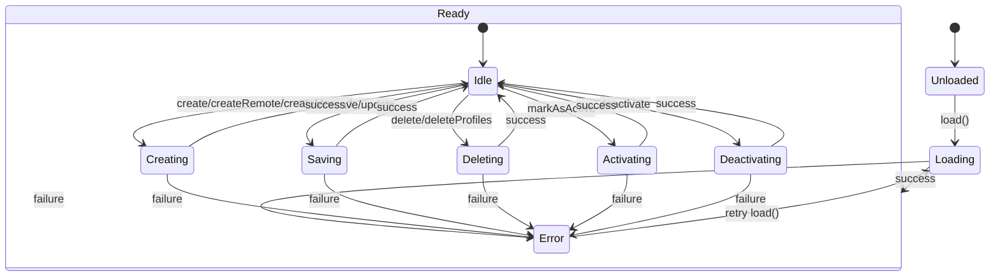
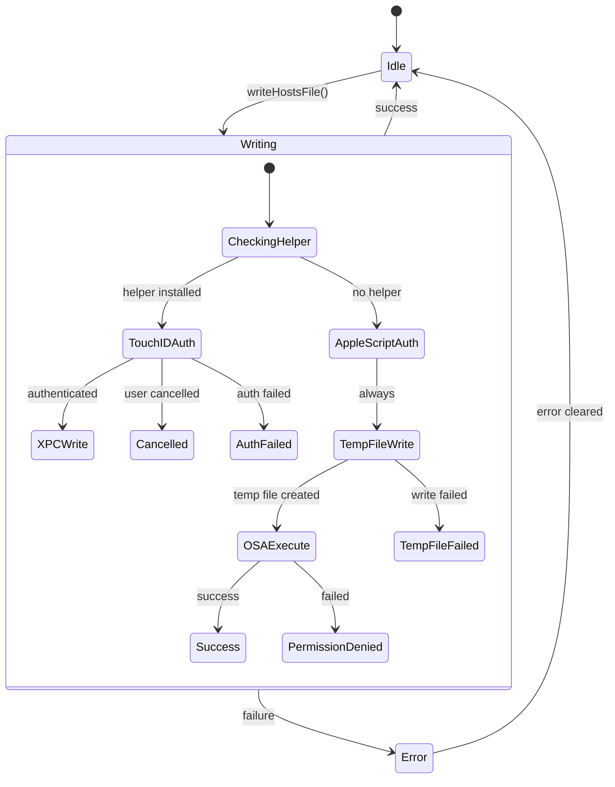
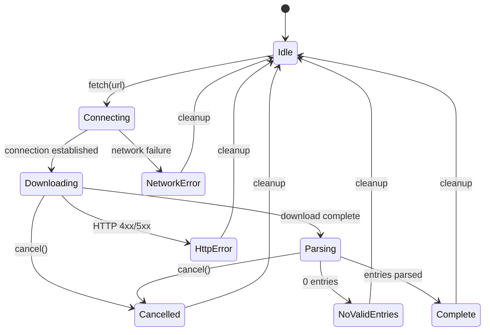
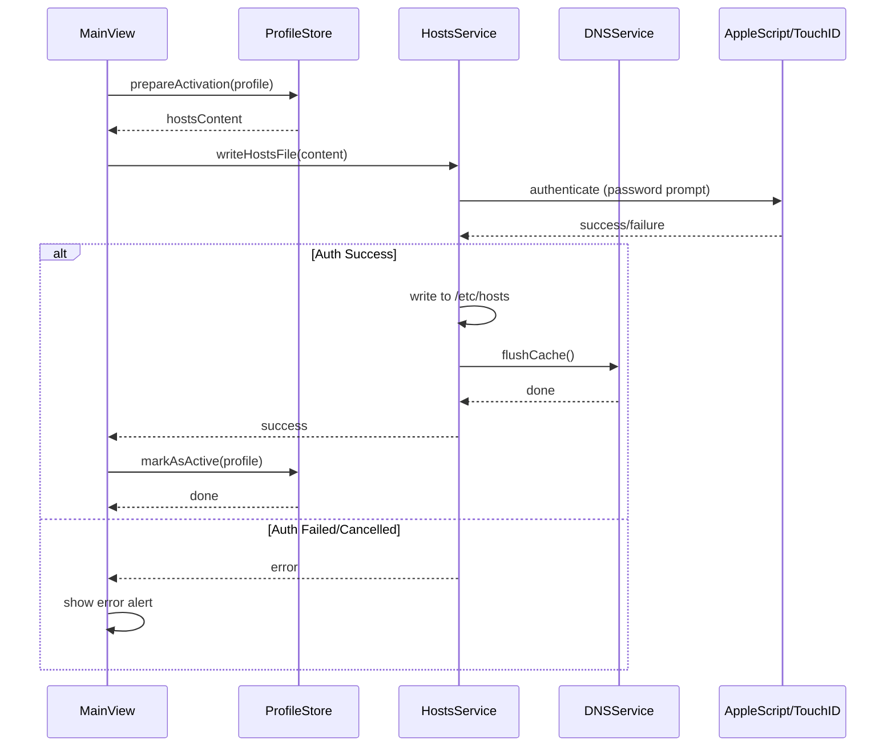
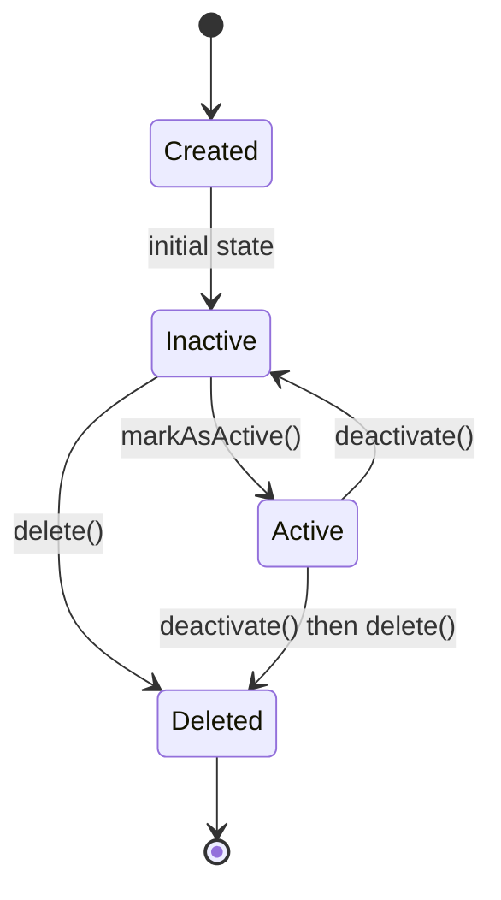
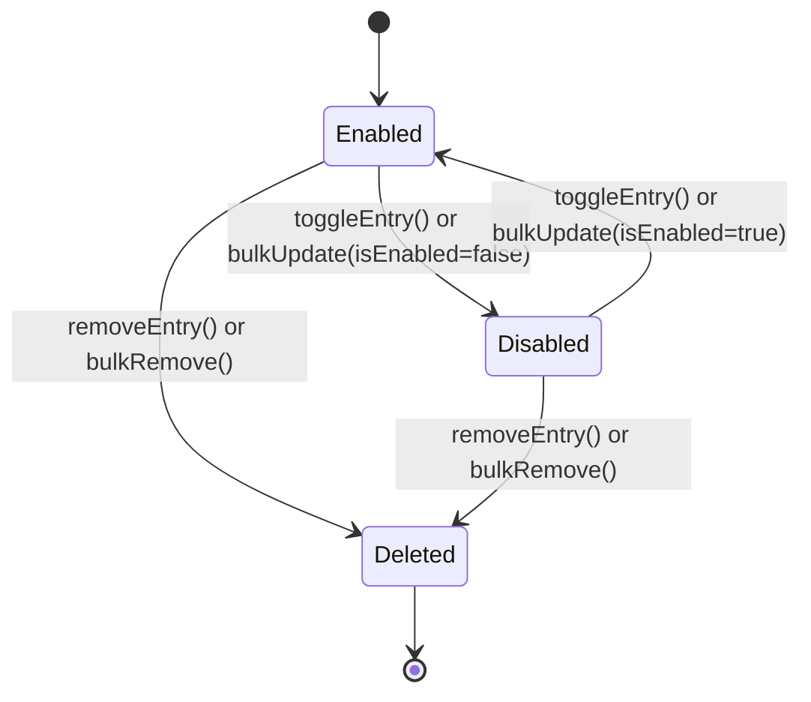
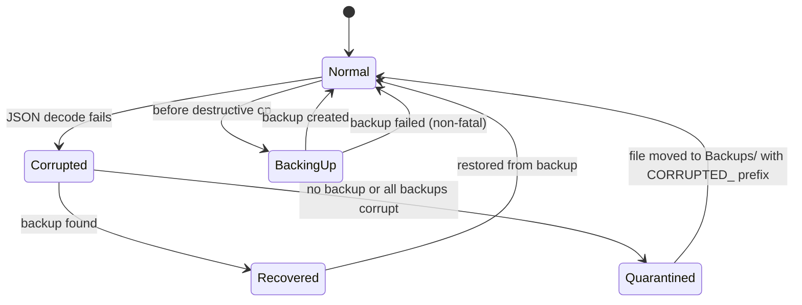

# SaneHosts State Machine Audit

> Generated: 2026-01-20
> Auditor: Claude Code (State Machine Audit Process)
> Template: 13-Section State Machine Audit

---

## Table of Contents

1. [State Diagrams](#1-state-diagrams)
2. [State Details](#2-state-details)
3. [Transitions](#3-transitions)
4. [Sub-State Machines](#4-sub-state-machines)
5. [Service Dependencies](#5-service-dependencies)
6. [Concurrency Model](#6-concurrency-model)
7. [Error Handling Matrix](#7-error-handling-matrix)
8. [Notifications](#8-notifications)
9. [External API Calls](#9-external-api-calls)
10. [Entry/Exit Actions](#10-entryexit-actions)
11. [Invariants](#11-invariants)
12. [Security Considerations](#12-security-considerations)
13. [Test Coverage Checklist](#13-test-coverage-checklist)

---

## 1. State Diagrams

### ProfileStore State Machine



### HostsService State Machine



### RemoteSyncService State Machine (ImportPhase)



### Profile Activation Flow



---

## 2. State Details

### ProfileStore States

| State | Properties | Effect |
|-------|------------|--------|
| **Unloaded** | `profiles = []`, `isLoading = false` | No data, cannot perform operations |
| **Loading** | `isLoading = true`, `error = nil` | I/O in progress, UI shows spinner |
| **Ready/Idle** | `isLoading = false`, `profiles.count > 0` | Normal operation, all CRUD available |
| **Error** | `error != nil` | Load failed, can retry |

### HostsService States

| State | Properties | Effect |
|-------|------------|--------|
| **Idle** | `isWriting = false`, `lastError = nil` | Ready to write |
| **Writing** | `isWriting = true` | UI disables activation buttons |
| **Error** | `lastError != nil` | Previous write failed, can retry |

### RemoteSyncService States (ImportPhase enum)

| State | Properties | Effect |
|-------|------------|--------|
| **idle** | `phase = .idle` | Ready for new import |
| **connecting** | `phase = .connecting`, `statusMessage = "Connecting..."` | Network request starting |
| **downloading** | `phase = .downloading`, `downloadProgress: Double` | File download in progress |
| **parsing** | `phase = .parsing`, `parseProgress: Double` | Stream parsing entries |
| **saving** | `phase = .saving` | Unused currently |
| **complete** | `phase = .complete`, `statusMessage = "Found X entries"` | Import succeeded |
| **error(String)** | `phase = .error(msg)` | Import failed with reason |

---

## 3. Transitions

### ProfileStore Transitions

| From | To | Trigger | Guards | Actions |
|------|-----|---------|--------|---------|
| Unloaded | Loading | `load()` | — | Set `isLoading = true` |
| Loading | Ready | File I/O success | `profiles != []` | Set `isLoading = false`, populate arrays |
| Loading | Error | File I/O failure | — | Set `error`, `isLoading = false` |
| Idle | Creating | `create()` | — | — |
| Creating | Idle | Save success | — | Append to `profiles`, sort, `notifyChange()` |
| Idle | Activating | `markAsActive()` | `profile.isActive == false` | — |
| Activating | Idle | Save success | — | Update `activeProfile`, `notifyChange()` |
| Idle | Deleting | `delete()` | `!profile.isActive` | Backup before delete |
| Deleting | Error | Profile is active | — | Throw `cannotDeleteActive` |

### HostsService Transitions

| From | To | Trigger | Guards | Actions |
|------|-----|---------|--------|---------|
| Idle | Writing | `writeHostsFile()` | — | Set `isWriting = true` |
| CheckingHelper | TouchIDAuth | — | `isHelperInstalled == true` | — |
| CheckingHelper | AppleScriptAuth | — | `isHelperInstalled == false` | — |
| TouchIDAuth | XPCWrite | Auth success | — | Call XPC helper |
| TouchIDAuth | Cancelled | — | User cancelled | Throw `userCancelled` |
| AppleScriptAuth | TempFileWrite | — | — | Create temp file |
| OSAExecute | Success | — | Script returns success | Cleanup temp, return |
| OSAExecute | PermissionDenied | — | Script error | Set `lastError`, throw |
| Writing | Idle | Any outcome | — | Set `isWriting = false` |

### RemoteSyncService Transitions

| From | To | Trigger | Guards | Actions |
|------|-----|---------|--------|---------|
| idle | connecting | `fetch(url)` | — | Cancel existing task, reset progress |
| connecting | downloading | HTTP response received | Status 2xx | Update phase |
| connecting | NetworkError | — | Network failure | Set phase to `.error()` |
| downloading | parsing | Download complete | — | Move temp file, start stream parse |
| downloading | HttpError | — | Status 4xx/5xx | Throw `httpError(code)` |
| parsing | complete | Entries parsed | `entries.count > 0` | — |
| parsing | NoValidEntries | — | `entries.count == 0` | Throw `noValidEntries` |
| any | cancelled | `cancel()` | Task not finished | Throw `cancelled` |
| any terminal | idle | defer block | — | Cleanup progress, remove from syncProgress |

---

## 4. Sub-State Machines

### Profile Lifecycle



### Entry Lifecycle



### Backup/Recovery Sub-Machine



---

## 5. Service Dependencies

```
┌─────────────────────────────────────────────────────────────────┐
│                         SaneHostsApp                            │
│                    (Window + Menu Bar)                          │
└────────────────────────────┬────────────────────────────────────┘
                             │
        ┌────────────────────┼────────────────────┐
        │                    │                    │
        ▼                    ▼                    ▼
┌──────────────┐    ┌──────────────┐    ┌──────────────────┐
│  MainView    │    │ MenuBarExtra │    │ SettingsView     │
│ (UI State)   │    │ (Mirror)     │    │                  │
└──────┬───────┘    └──────┬───────┘    └──────────────────┘
       │                   │
       └─────────┬─────────┘
                 │
                 ▼
┌───────────────────────────────────────────────────────────┐
│                    ProfileStore.shared                     │
│  • profiles: [Profile]                                     │
│  • activeProfile: Profile?                                 │
│  • systemEntries: [HostEntry]                              │
└────────────────────────────┬──────────────────────────────┘
                             │
        ┌────────────────────┼────────────────────┐
        │                    │                    │
        ▼                    ▼                    ▼
┌──────────────┐    ┌──────────────┐    ┌──────────────────┐
│ HostsParser  │    │RemoteSyncSvc │    │ HostsService     │
│ (stateless)  │    │   .shared    │    │    .shared       │
└──────────────┘    └──────┬───────┘    └────────┬─────────┘
                           │                     │
                           │                     │
                           ▼                     ▼
                    ┌──────────────┐    ┌──────────────────┐
                    │ URLSession   │    │ AuthService      │
                    │  (Network)   │    │ + Helper/ASA     │
                    └──────────────┘    └────────┬─────────┘
                                                 │
                                                 ▼
                                        ┌──────────────────┐
                                        │   DNSService     │
                                        │    .shared       │
                                        └──────────────────┘
```

### Dependency Direction

| Service | Depends On | Depended By |
|---------|------------|-------------|
| **ProfileStore** | HostsParser, FileManager | MainView, MenuBarExtra |
| **HostsService** | HostsParser, AuthService, HelperConnection, DNSService | ProfileStore (via activation) |
| **RemoteSyncService** | HostsParser, URLSession | MainView (import flow) |
| **DNSService** | Shell (dscacheutil, killall) | HostsService |
| **AuthService** | LAContext (LocalAuthentication) | HostsService |
| **HostsParser** | — (stateless) | ProfileStore, HostsService, RemoteSyncService |

---

## 6. Concurrency Model

### Thread Isolation

| Component | Thread | Isolation Mechanism |
|-----------|--------|---------------------|
| **All Services** | Main | `@MainActor` class annotation |
| **File I/O** | Background | `Task.detached(priority: .userInitiated)` |
| **JSON Encoding** | Background | `Task.detached` for large profiles |
| **Network Requests** | URLSession queue | `URLSession.shared.download()` |
| **AppleScript** | Global QoS queue | `DispatchQueue.global(qos: .userInitiated)` |
| **XPC Callbacks** | XPC queue | `CheckedContinuation` bridge to async |
| **DNS Flush** | Background | `Task.detached(priority: .utility)` |

### Race Condition Mitigations

| Potential Race | Mitigation | Location |
|----------------|------------|----------|
| Concurrent profile edits | `@MainActor` ensures serial access | ProfileStore |
| Active profile during delete | Guard: `!profile.isActive` | `delete()` |
| Double activation | Deactivate current first, then activate | `markAsActive()` |
| Concurrent fetch cancellation | `currentTask?.cancel()` before new | RemoteSyncService |
| Progress updates during parse | `MainActor.run {}` from detached task | RemoteSyncService |
| XPC callback on wrong thread | `CheckedContinuation` | HostsService |

### Async Task Lifecycle

| Task Type | Created In | Cancellation |
|-----------|------------|--------------|
| Profile load/save | ProfileStore | Not cancellable (atomic) |
| Remote fetch | RemoteSyncService | `currentTask?.cancel()`, `Task.checkCancellation()` |
| Parse iteration | RemoteSyncService | `Task.checkCancellation()` every line |
| DNS flush | DNSService | Not cancellable (quick) |
| AppleScript exec | HostsService | Not cancellable (blocking prompt) |

### Known Concurrency Issues

| Issue | Severity | Status |
|-------|----------|--------|
| DispatchSemaphore in `checkHelperInstalled()` | LOW | Runs on background, timeout 1s |
| `try?` swallows errors in cleanup | LOW | Non-critical paths only |
| No retry logic for transient network failures | MEDIUM | User must retry manually |

---

## 7. Error Handling Matrix

### ProfileStore Errors

| Operation | Error Condition | Error Type | Handling | User Impact |
|-----------|-----------------|------------|----------|-------------|
| `load()` | Directory creation fails | `loadFailed` | Set `error`, stop | "Failed to load profiles" alert |
| `load()` | JSON decode fails | Corrupted file | Recover from backup or quarantine | Silent, profile skipped |
| `save()` | Disk full / permissions | `saveFailed` | Set `error` | "Failed to save" alert |
| `delete()` | Profile is active | `cannotDeleteActive` | Throw | "Deactivate first" alert |
| `addEntry()` | Profile not found | `profileNotFound` | Throw | Alert shown |

### HostsService Errors

| Operation | Error Condition | Error Type | Handling | User Impact |
|-----------|-----------------|------------|----------|-------------|
| `writeHostsFile()` | Temp file write fails | `tempFileWriteFailed` | Set `lastError`, throw | "Failed to prepare" alert |
| `writeHostsFile()` | User clicks Cancel | `userCancelled` | Throw | Silent (expected) |
| `writeHostsFile()` | Wrong password | `authenticationFailed` | Set `lastError`, throw | "Authentication failed" alert |
| `writeHostsFile()` | AppleScript fails | `writePermissionDenied` | Set `lastError`, throw | "Permission denied" alert |
| `readSystemHosts()` | File not readable | `readFailed` | Throw | Load fails |

### RemoteSyncService Errors

| Operation | Error Condition | Error Type | Handling | User Impact |
|-----------|-----------------|------------|----------|-------------|
| `fetch()` | No network | `networkError` | Set phase to `.error`, throw | "Network error" in sheet |
| `fetch()` | HTTP 404/500 | `httpError(code)` | Set phase to `.error`, throw | "HTTP error X" in sheet |
| `fetch()` | Invalid encoding | `invalidEncoding` | Throw | "Could not decode" alert |
| `fetch()` | Empty file | `noValidEntries` | Throw | "No valid entries" alert |
| `fetch()` | User cancels | `cancelled` | Throw | Sheet closes |

### DNSService Errors

| Operation | Error Condition | Error Type | Handling | User Impact |
|-----------|-----------------|------------|----------|-------------|
| `flushCache()` | dscacheutil fails | `flushFailed` | Throw | "Failed to flush DNS" alert (non-blocking) |

---

## 8. Notifications

### Sent Notifications

| Notification | Sender | Payload | When |
|--------------|--------|---------|------|
| `.profileStoreDidChange` | ProfileStore | `nil` | After any CRUD, activation change |

### Received Notifications

| Notification | Receiver | Action |
|--------------|----------|--------|
| `.profileStoreDidChange` | MenuBarProfileStore | Refresh state from ProfileStore.shared |

### NotificationCenter Flow

```
ProfileStore.save() / markAsActive() / deactivate()
        │
        └──► notifyChange()
                  │
                  └──► NotificationCenter.post(.profileStoreDidChange)
                              │
                              └──► MenuBarProfileStore.objectWillChange
                                          │
                                          └──► MenuBarExtra UI refresh
```

---

## 9. External API Calls

### System APIs

| API | Used In | Purpose | Can Fail | Retry Strategy |
|-----|---------|---------|----------|----------------|
| `FileManager.contentsOfDirectory()` | ProfileStore.load() | List profile files | Yes | User retry |
| `String(contentsOfFile:)` | HostsService.read() | Read /etc/hosts | Yes | User retry |
| `Data.write(to:options:)` | ProfileStore.save() | Save profile JSON | Yes | User retry |
| `NSAppleScript.executeAndReturnError()` | HostsService | Privileged write | Yes | User retry |
| `URLSession.shared.download()` | RemoteSyncService | Download blocklist | Yes | User retry |
| `dscacheutil -flushcache` | DNSService | Flush DNS cache | Yes | Silent fail OK |
| `killall -HUP mDNSResponder` | DNSService | Restart resolver | Yes | Silent fail OK |

### XPC APIs (Future)

| API | Used In | Purpose | Can Fail |
|-----|---------|---------|----------|
| `NSXPCConnection` | HostsHelperConnection | Connect to helper | Yes |
| `HostsHelperProtocol.writeHostsFile()` | HostsService | Privileged write | Yes |

### LocalAuthentication APIs

| API | Used In | Purpose | Can Fail |
|-----|---------|---------|----------|
| `LAContext.canEvaluatePolicy()` | AuthService | Check biometric availability | No |
| `LAContext.evaluatePolicy()` | AuthService | Authenticate user | Yes |

---

## 10. Entry/Exit Actions

### ProfileStore States

| State | On Enter | On Exit |
|-------|----------|---------|
| **Loading** | `isLoading = true`, `error = nil` | `isLoading = false` |
| **Ready** | `notifyChange()` | — |
| **Error** | `error = <value>` | `error = nil` (on retry) |

### HostsService States

| State | On Enter | On Exit |
|-------|----------|---------|
| **Writing** | `isWriting = true`, `lastError = nil` | `isWriting = false` |
| **Error** | `lastError = <value>` | — |

### RemoteSyncService States

| State | On Enter | On Exit |
|-------|----------|---------|
| **connecting** | `phase = .connecting`, `syncProgress[url] = .fetching` | — |
| **downloading** | `phase = .downloading`, update statusMessage | — |
| **parsing** | `phase = .parsing`, `syncProgress[url] = .parsing` | — |
| **complete** | `phase = .complete`, `syncProgress[url] = .complete` | — |
| **error** | `phase = .error()`, `syncProgress[url] = .error()` | — |
| **idle** | Reset: `phase = .idle`, `downloadProgress = 0`, `parseProgress = 0`, remove from `syncProgress` | — |

### Profile Entity States

| State | On Enter | On Exit |
|-------|----------|---------|
| **Active** | `isActive = true`, save to disk | — |
| **Inactive** | `isActive = false`, save to disk | — |
| **Deleted** | Backup created, file removed from disk | Removed from `profiles` array |

---

## 11. Invariants

| Invariant | Enforced By | Violation Impact |
|-----------|-------------|------------------|
| At most ONE profile is active | `markAsActive()` deactivates current first | Multiple green badges, undefined /etc/hosts |
| Active profile cannot be deleted | Guard in `delete()` | Data loss |
| System entries preserved in /etc/hosts | `parser.merge()` always includes them | System network failure |
| Profile IDs are unique UUIDs | UUID() generation | Profile lookup fails |
| Profiles sorted by sortOrder | After every mutation, call `.sort()` | List order inconsistent |
| `isLoading` true only during load() | `defer { isLoading = false }` | Perpetual spinner |
| `isWriting` true only during write | `defer { isWriting = false }` | UI lockup |
| Entries limited to 500K max | Guard in `addEntries()`, `createRemote()` | Memory crash |
| Backups capped at 3 per profile | `cleanupOldBackups()` | Disk space exhaustion |

---

## 12. Security Considerations

| Concern | Mitigation | Notes |
|---------|------------|-------|
| **Privilege Escalation** | AppleScript with `administrator privileges` prompts for password | User must approve each activation |
| **Hosts File Injection** | Parser validates IP format, hostnames | Rejects malformed entries |
| **Temp File Race** | Atomic write, unique UUID filenames | `/tmp/sanehosts-<UUID>.hosts` |
| **Path Injection in AppleScript** | `quoted form of` for shell escaping | Prevents command injection |
| **XSS in Hostnames** | Hostnames displayed as plain text, not HTML | SwiftUI Text() is safe |
| **Profile Tampering** | JSON stored in user-writable Application Support | User can modify their own data (acceptable) |
| **Backup Exposure** | Backups in same directory as profiles | Same access control |
| **Network MITM** | URLSession uses TLS by default | Blocklist URLs should be HTTPS |
| **Hardened Runtime** | Enabled for notarization | Prevents code injection |
| **AppleEvents Entitlement** | Required for AppleScript automation | `com.apple.security.automation.apple-events` |
| **Not Sandboxed** | Required to write /etc/hosts | Cannot use App Store distribution |

---

## 13. Test Coverage Checklist

### ProfileStore Tests

- [ ] `load()` creates default profile on first run
- [ ] `load()` migrates existing /etc/hosts entries
- [ ] `load()` recovers corrupted profiles from backup
- [ ] `load()` quarantines unrecoverable corrupted files
- [ ] `create()` assigns unique sortOrder
- [ ] `createRemote()` limits to 500K entries
- [ ] `createMerged()` deduplicates by hostname
- [ ] `save()` uses atomic write
- [ ] `delete()` throws for active profile
- [ ] `delete()` creates backup first
- [ ] `deleteProfiles()` batch deletes non-active profiles
- [ ] `duplicate()` generates unique name (Name 1, Name 2...)
- [ ] `merge()` deduplicates entries
- [ ] `moveProfiles()` updates sortOrder
- [ ] `markAsActive()` deactivates current first
- [ ] `deactivate()` clears activeProfile
- [ ] `addEntry()` throws for missing profile
- [ ] `addEntries()` limits to maxEntries
- [ ] `bulkUpdateEntries()` single disk write
- [ ] `bulkRemoveEntries()` single disk write
- [ ] `notifyChange()` posted after mutations

### HostsService Tests

- [ ] `readSystemHosts()` returns /etc/hosts content
- [ ] `parseSystemHosts()` extracts entries
- [ ] `getSystemEntries()` filters localhost/broadcasthost
- [ ] `writeHostsFile()` creates temp file first
- [ ] `writeHostsFile()` cleans up temp file after
- [ ] `writeHostsFile()` handles user cancellation
- [ ] `writeHostsFile()` handles auth failure
- [ ] `activateProfile()` flushes DNS
- [ ] `deactivateProfile()` restores system-only entries
- [ ] `deactivateProfile()` flushes DNS
- [ ] AppleScript path escaping handles special characters

### RemoteSyncService Tests

- [ ] `fetch()` downloads file to temp location
- [ ] `fetch()` rejects HTTP 4xx/5xx
- [ ] `fetch()` parses entries via stream
- [ ] `fetch()` limits to 100K entries
- [ ] `fetch()` updates progress every 1000 lines
- [ ] `fetch()` respects cancellation
- [ ] `fetchAll()` parallel fetches multiple URLs
- [ ] `checkForUpdates()` uses ETag/Last-Modified
- [ ] Phase transitions in correct order
- [ ] Cleanup runs on success and failure

### HostsParser Tests

- [x] `parse()` handles comments
- [x] `parse()` handles blank lines
- [x] `parse()` handles commented-out entries (# 127.0.0.1 ...)
- [x] `isValidIPAddress()` accepts IPv4
- [x] `isValidIPAddress()` accepts IPv6
- [x] `isValidIPAddress()` rejects invalid
- [x] `isValidHostname()` validates RFC format
- [x] `extractSystemEntries()` filters localhost
- [x] `extractUserEntries()` excludes system entries
- [x] `merge()` preserves system entries
- [x] `generate()` produces valid hosts format

### DNSService Tests

- [ ] `flushCache()` runs dscacheutil
- [ ] `flushCache()` sends HUP to mDNSResponder
- [ ] `wasRecentlyFlushed` returns true within 60s

### Integration Tests

- [x] Custom URL import creates profile with entries
- [ ] Multiple blocklist import deduplicates
- [ ] Activate → deactivate → reactivate cycle
- [ ] Large profile (100K+ entries) performance
- [ ] Concurrent activation attempts
- [ ] Network failure during import

### UI Tests (Manual)

- [ ] Sidebar selection syncs with detail view
- [ ] Menu bar mirrors main window state
- [ ] Activate button shows password prompt
- [ ] Progress UI during large import
- [ ] Search debounce works (300ms)
- [ ] Bulk selection mode toggles
- [ ] Keyboard shortcuts work (Cmd+N, Cmd+D, etc.)
- [ ] Settings toggles persist
- [ ] Hide Dock Icon setting works
- [ ] Launch at Login setting works

---

## Summary Findings

### Strengths

1. **Clean @MainActor isolation** - All observable state is main-thread safe
2. **Background I/O** - Heavy operations don't block UI
3. **Atomic writes** - Profile saves use `.atomic` option
4. **Backup system** - Crash resilience with recovery
5. **Stream parsing** - Large files don't exhaust memory
6. **Cancellation support** - Remote imports can be cancelled

### Areas for Improvement

| Priority | Issue | Recommendation |
|----------|-------|----------------|
| **HIGH** | XPC helper not wired up | Complete SMAppService registration for Touch ID |
| **MEDIUM** | No retry logic for network | Add exponential backoff for transient failures |
| **MEDIUM** | DispatchSemaphore in helper check | Replace with async/await pattern |
| **LOW** | `try?` swallows some errors | Log failures even if non-fatal |
| **LOW** | No update mechanism for remote profiles | Add "Refresh" button to re-fetch |

### Test Gaps

- Unit test coverage for services is limited (parser has good coverage)
- No UI tests automated
- Integration tests for activation flow missing
- Performance tests for large datasets missing

---

*End of Audit*
